---
# 🔍 Opportunity Crawler




> Automated daily pipeline that scrapes cybersecurity jobs, internships, government programs, and CTF competitions — filters with AI scoring — and sends ranked alerts to your Telegram. No server needed. Runs free on GitHub Actions.

**Built for:** B.Tech/B.E. CS students in India targeting SOC, VAPT, detection engineering, and government cybersecurity programs.

---

## ✨ What It Does

Every day at **9:00 PM IST**, this bot:

1. **Scrapes 11 sources** — LinkedIn, NCS, Google News, CERT-In/DSCI, HackerEarth, GitHub, Reddit netsec, government portals (CDAC, MeitY, NCIIPC, AICTE, NICSI)
2. **Hard-filters noise** — blocks senior/mid-level roles, non-India locations, physical security jobs, annotation-disguised-as-security postings (Alignerr etc.)
3. **Keyword scores** — 67 cybersecurity-specific keywords
4. **AI scores with Groq** — each item gets a 1–10 relevance score against your resume profile using free Groq LLMs
5. **Deduplicates** — never sends the same opportunity twice (10-day memory)
6. **Sends ranked Telegram alerts** — sorted by AI score, Hyderabad/your city first within same score

You will never miss an opportunity like APCSIP, NCIIPC internship, or a fresh SOC L1 opening again.

---

## ⚙️ How It Works

```
GitHub Actions (cron 9PM IST)
  → main.py
    → scraper.py       scrapes all 11 sources (~260 raw items)
    → filter.py        3-stage pipeline:
        Stage 1: hard_exclude()   — instant, no API (blocks ~100 items)
        Stage 2: keyword_score()  — 67 keywords, min score 1 to pass (~28 miss)
        Stage 3: ai_score_groq()  — Groq LLM, 1-10 score, threshold ≥7 (~30 filtered)
    → dedup.py         seen_urls.json, 10-day retention
    → notifier.py      Telegram Bot API, sorted by score
```

**AI Model chain (Groq free tier, round-robin):**
1. `qwen/qwen3.6-27b` — primary
2. `openai/gpt-oss-20b` — secondary
3. `openai/gpt-oss-120b` — fallback

**Runtime:** ~18 minutes per daily run. GitHub Actions free tier gives 2,000 min/month — this uses ~540 min/month.

---

## 🚀 Setup Guide

### Prerequisites
- GitHub account
- Telegram account
- Groq account (free) — [console.groq.com](https://console.groq.com)

---

### Step 1 — Fork this repo

Click **Fork** (top right of this page) → it appears in your GitHub account with all files and the workflow ready.

---

### Step 2 — Create a Telegram Bot

1. Open Telegram → search **@BotFather** → send `/newbot`
2. Give it a name (e.g. `My Job Crawler`) and a username ending in `bot`
3. BotFather gives you a **token** like `123456789:ABCdef...` — save it
4. Click the bot link BotFather gives you → press **Start**
5. Send any message to the bot (e.g. "hello")
6. Open this URL in your browser (replace `YOUR_TOKEN`):
   ```
   https://api.telegram.org/botYOUR_TOKEN/getUpdates
   ```
7. Find `"chat":{"id":XXXXXXXX}` — that number is your **Chat ID** — save it

---

### Step 3 — Get a Groq API Key

1. Go to [console.groq.com](https://console.groq.com) → sign up free
2. Go to **API Keys** → **Create API Key**
3. Copy the key (starts with `gsk_...`) — save it

The free tier gives 1,000 requests/day per model × 3 models = plenty for one daily run.

---

### Step 4 — Add GitHub Secrets

Go to your forked repo → **Settings** → **Secrets and variables** → **Actions** → **New repository secret**

Add all three:

| Secret Name | Value |
|---|---|
| `GROQ_API_KEY` | Your Groq key starting with `gsk_...` |
| `TELEGRAM_BOT_TOKEN` | Token from BotFather e.g. `123456789:ABCdef...` |
| `TELEGRAM_CHAT_ID` | Your chat ID number e.g. `987654321` |

---

### Step 5 — Customize your profile

Edit `resume_profile.yaml` with your own details — your degree, skills, experience, and what roles you're targeting. The AI uses this file to score how relevant each opportunity is **for you specifically**.

```yaml
name: Your Name
location: Your City, India

education:
  degree: B.Tech CSE (Cybersecurity)
  university: Your University

technical_skills:
  pentesting_tools: [Burp Suite, Nmap, Metasploit]
  siem_soc: [Splunk]

seeking:
  roles:
    - Cybersecurity internship
    - SOC analyst internship
```

---

### Step 6 — Enable and test

1. Go to your repo → **Actions** tab
2. If prompted, click **"I understand my workflows, enable them"**
3. Click **Daily Opportunity Crawler** in the left sidebar
4. Click **Run workflow** → **Run workflow**
5. Watch the live logs — it takes ~18 minutes
6. Check Telegram for your first batch of alerts

After the first successful run, it runs automatically every day at 9 PM IST.

---

## 🛠 Customization

### Change keywords

Edit `config.yaml`:

```yaml
keywords:
  - cybersecurity intern
  - SOC analyst
  - your custom keyword
```

### Change run time

Edit `.github/workflows/crawl.yml`:

```yaml
- cron: '30 15 * * *'   # 9 PM IST = 3:30 PM UTC
```

UTC → IST: IST = UTC + 5:30. So `30 15` (15:30 UTC) = 21:00 IST (9 PM).

### Tune AI budget

Edit `config.yaml`:

```yaml
ai_matching:
  daily_budget: 120   # max items sent to AI per run
```

Higher = more items scored but longer runtime. 120 covers all items at typical scrape volume.

### Disable noisy sources

```yaml
sources:
  wellfound:
    enabled: false   # returns 0 items, effectively dead
  hackerearth:
    enabled: false   # no cybersecurity content
```

### Block a company

Edit `crawler/filter.py` → find `_BLOCKED_COMPANIES`:

```python
_BLOCKED_COMPANIES = {
    "alignerr",      # AI annotation jobs disguised as security roles
    "scoutit",       # bulk identical postings
    "your_company",  # add any noisy company here
}
```

---

## 📁 Project Structure

```
opportunity-crawler/
├── main.py                   # Orchestrator — runs all stages in order
├── config.yaml               # Keywords, sources, AI budget settings
├── resume_profile.yaml       # YOUR profile — AI matches against this
├── requirements.txt          # Python dependencies
├── .gitignore
├── .github/
│   └── workflows/
│       └── crawl.yml         # GitHub Actions cron (9 PM IST daily)
├── crawler/
│   ├── scraper.py            # 11 source scrapers
│   ├── filter.py             # 3-stage filter pipeline + AI scoring
│   ├── dedup.py              # seen_urls.json — 10-day dedup store
│   └── notifier.py           # Telegram sender
├── seen_urls.json            # Auto-updated by Actions after each run
├── debug_ai_scores.json      # Last run: all AI scores (for debugging)
└── debug_excluded.json       # Last run: all hard-excluded items + reasons
```

---

## 🔍 Active Sources

| Source | What it scrapes |
|--------|----------------|
| LinkedIn | SOC, VAPT, security analyst, intern roles — India |
| NCS (National Career Service) | Government job portal |
| Google News | Cybersecurity internship announcements |
| CERT-In / DSCI | Government cybersecurity programs |
| CDAC / MeitY / NCIIPC / AICTE / NICSI | Govt portals for training/intern programs |
| HackerEarth | CTF competitions and hackathons |
| GitHub API | Security research programs and bounties |
| Reddit netsec / cybersec | Hiring megathreads |
| RSS (InfoSec Jobs, HN) | Job board feeds |

**Permanently disabled:** Indeed (403), Internshala (fake listings), Unstop (non-security noise), TimeJobs (connection failed)

---

## 🧠 How AI Filtering Works

Each opportunity that passes keyword filtering gets sent to a Groq LLM with:
- The job title, company, description
- Your full `resume_profile.yaml`
- A prompt asking: *"Score 1–10 how relevant this is for this specific candidate"*

**Score ≥ 7** → sent to Telegram  
**Score ≤ 6** → silently dropped

The AI catches things keyword filters miss:
- "Security Analyst" at a company that does AI annotation (score: 2)
- "Cybersecurity Intern" requiring 3+ years experience (score: 1)
- "SOC L1 Support" at a major bank for freshers (score: 10)

---

## 🔒 Security

- **No secrets in code** — all API keys stored in GitHub Secrets only, read via `os.environ`
- **Public repo is safe** — nothing sensitive in any committed file
- `seen_urls.json` and debug files contain only job URLs and scores — no personal data

---

## 🐛 Troubleshooting

**No Telegram messages:**
- Make sure you sent at least one message to your bot first (required to open the chat)
- Verify Chat ID: `https://api.telegram.org/botYOUR_TOKEN/getUpdates`
- Check Actions logs for `[Notifier]` lines

**All scores are 7 (no AI filtering):**
- Your `GROQ_API_KEY` secret may be missing or incorrect
- Check Actions logs for `[Groq]` error lines

**Run takes too long / times out:**
- Lower `daily_budget` in `config.yaml` to 80
- Each AI call takes ~9 seconds; budget × 9s = total AI time

**Too many irrelevant results:**
- Add unwanted companies to `_BLOCKED_COMPANIES` in `filter.py`
- Add unwanted title patterns to `_EXCLUDE_TITLE_RAW` in `filter.py`

**LinkedIn returning 0 items:**
- LinkedIn rate-limits scrapers. This is normal occasionally.
- The scraper auto-recovers on the next run.

**Check full logs:**
- Actions tab → Daily Opportunity Crawler → latest run → click **crawl** job → expand each step

---

## 💰 Cost

| Service | Cost |
|---------|------|
| GitHub Actions | Free (uses ~540 of 2,000 free min/month) |
| Groq API | Free (uses ~360 of 3,000 free daily calls) |
| Telegram Bot API | Free forever |
| **Total** | **₹0 / month** |

---

## 📌 Version

**v1.0** — July 2026  
Built by [arvdch](https://github.com/arvdch)
